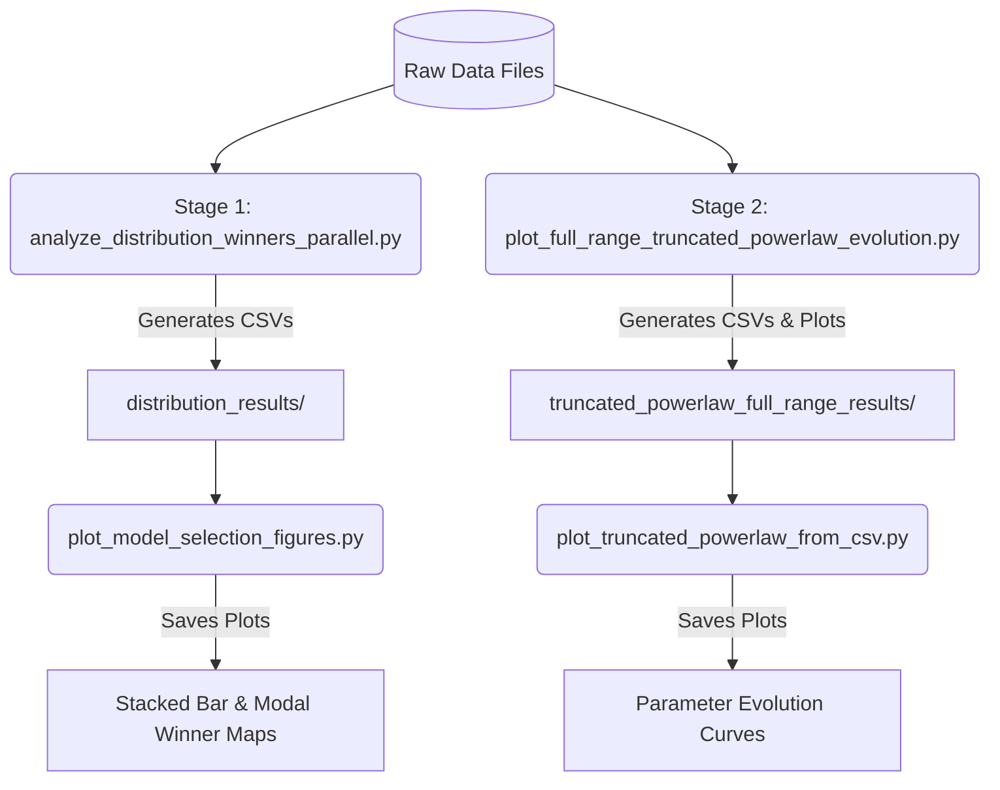

# Sandpile Robustness & Avalanche Distribution Analysis

This repository provides a suite of parallel analysis tools and visualization scripts designed to study the statistical behavior of avalanche-duration distributions in degraded Bak–Tang–Wiesenfeld (BTW) sandpile simulations on networks subject to node removal and random rewiring.

The repository contains Python scripts used to:

1. compare candidate distributions for avalanche-duration data;
2. summarize the winning distribution across independent runs;
3. generate model-selection figures;
4. fit full-range truncated power laws;
5. regenerate figures directly from generated CSV files.

The data are **included** in this repository but should be substituted by those of your experiments.

## Expected data layout

The scripts expect avalanche-duration frequency files with two columns:

```text
value frequency
```
where `value` represents the avalanche duration, and `frequency` is the observation count.

### Directory Structure

Place your simulation data in the `data/` directory using the following hierarchical organization:

```text
data/
└── avex_data/
    ├── exp1/
    │   ├── d0_r0.dat
    │   ├── d0_r10.dat
    │   ├── d45_r10.dat
    │   └── ...
    ├── exp2/
    │   └── ...
    └── exp25/
        └── ...
```

### Filename Naming Convention

File names must strictly follow the parameter pattern:
`d<degradation>_r<rewiring>.dat`
- **`<degradation>`**: percentage of nodes removed (e.g., `0`, `45`).
- **`<rewiring>`**: rewiring probability rate (e.g., `0`, `10`).

---

## Installation & Environment Setup

A requirements file (`requirements.txt`) listing all Python dependencies is included. You can set up your environment using Conda:

```bash
# Create and activate conda environment
conda create -n powerlawfit python=3.12 -y
conda activate powerlawfit

# Install dependencies
pip install -r requirements.txt
```

> [!TIP]
> If you encounter compatibility or binary compilation warnings between NumPy and Matplotlib, install a conservative NumPy version:
> ```bash
> pip install "numpy<2"
> ```

---

## Pipeline & Scripts Guide

The analysis pipeline consists of two primary stages: **distribution comparison & model selection**, followed by **truncated power-law parameter evolution analysis**.



### Stage 1: Candidate Distribution Model Selection

#### 1. Running the Selection Tool
Fit candidate distributions in parallel across all experiments:
```bash
python scripts/analyze_distribution_winners_parallel.py
```
This script automates fitting using the `powerlaw` library, computes relative log-likelihoods, scores each distribution under AIC/AICc/BIC criteria, runs Vuong nested tests, and aggregates manuscript placeholder percentages.

- **Outputs created under `distribution_results/all_experiments/`**:
  - `best_distributions_all.csv` / `best_distributions_by_file.csv`: Raw outcomes containing best and second-best fits, p-values, and rankings for every single file.
  - `distribution_percentages_AICc.csv`, `_AIC.csv`, `_BIC.csv`: Winning composition frequencies per (degradation, rewiring) configuration under each criterion.
  - `lrt_placeholders_summary.csv` / `lrt_fraction_by_d_r.csv`: Summary of nested LRTs indicating where the exponential cutoff is statistically required.

#### 2. Plotting Model Selection Results
Generate win-frequency bar charts and modal distribution maps from the Stage 1 outputs:
```bash
python scripts/plot_model_selection_figures.py
```
- **Outputs generated under `distribution_results/all_experiments/model_selection_figures/`**:
  - `stacked_bars_combined_by_rewiring/`: Stacked bar charts showing distribution frequency compositions binned at 1% and 5% degradation steps.
  - `modal_winner_map/`: Scatter map grids showing the dominant distribution model at each parameter junction.

---

### Stage 2: Full-Range Truncated Power-Law Evolution

#### 1. Fitting the Full-Range TPL
Fit a truncated power-law model ($xmin$ fixed to the minimum observed value) across all experimental datasets in parallel:
```bash
python scripts/plot_full_range_truncated_powerlaw_evolution.py
```
This isolates the evolution of parameters $\alpha$ (exponent) and $\lambda$ (exponential cutoff) across degradation and rewiring levels, plotting them with percentile uncertainty bands.

- **Outputs created under `truncated_powerlaw_full_range_results/`**:
  - `truncated_powerlaw_full_range_parameters.csv`: Raw fit parameters ($\alpha$, $\lambda$) for all processed data files.
  - `truncated_powerlaw_full_range_summary.csv`: Aggregated parameter statistics (means, medians, standard deviations, percentiles) across experiments.
  - `truncated_powerlaw_full_range_alpha_lambda.png` / `.pdf`: Line charts of $\alpha$ and $\lambda$ versus degradation rate.
  - `truncated_powerlaw_full_range_lrt_fraction.png` / `.pdf`: Nested LRT significance curves showing the percentage of runs favoring the TPL cutoff over a pure PL.

#### 2. Plotting Parameter Evolution from CSV
Regenerate Stage 2 line plots quickly from existing CSV summaries without refitting:
```bash
python scripts/plot_truncated_powerlaw_from_csv.py
```

#### 3. Visual Examples of Fit Curves
To plot individual log-log PDF curves matching specific parameters (useful for paper figures):
```bash
python scripts/plot_truncated_powerlaw_examples.py
```
This fits and visualizes empirical data against pure PL and TPL theoretical curves for sample configurations (e.g. `d0_r0.dat` and `d45_r10.dat`).

---

## License

This repository is distributed under the MIT License. See [LICENSE](LICENSE) for details.
